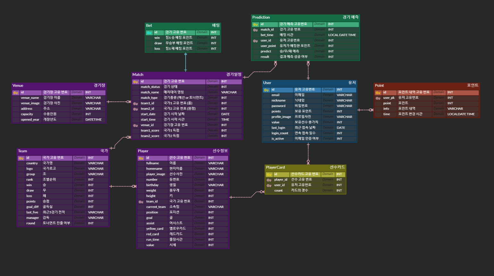
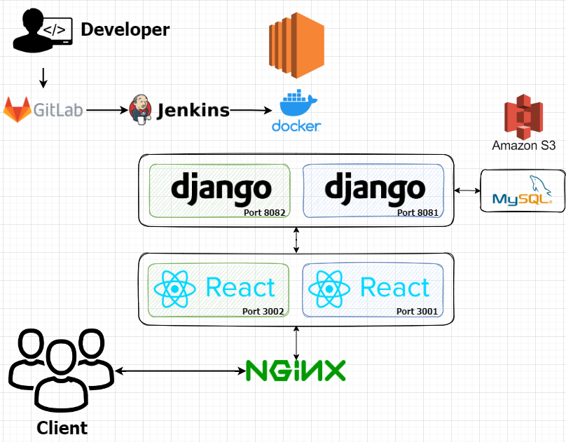

# ⚽축배: 월드컵 정보 제공 서비스🏆

**2022.10.11~2022.11.25**

---

## 목차

1. [**서비스 소개**](#1)
2. [**기술 스택**](#2)
3. [**ERD**](#3)
4. [**아키텍처**](#4)
5. [**기능**](#5)
6. [**개발 멤버 소개**](#6)
7. [**프로젝트 관련 문서**](#7)

 

## 💡 서비스 소개

> 월드컵 API를 받아와서 경기 및 선수 정보를 제공하고, 선수 카드를 활용한 게이미피케이션 서비스

 

## 🛠️ 기술 스택

 

 

 

 

## 📋ERD

## 🗂️ 아키텍처

## 🖥️ 기능

- 축구 정보 확인
    - 조별, 국가별 축구 경기 정보 확인
    - 차트를 통해 국가별 성적을 시각화
    - 국가별 대표팀 상세 정보 확인
- 승패 예측
    - 경기 시작 5분전까지 승부 예측 가능
    - 매일 1회 일정 시간마다 포인트 정산
    - 다른 사람들의 베팅 정보 시각화

- 가차(선수 뽑기)
    - 1회, 10회 뽑기로 월드컵 출전 선수 획득 가능
    - 월드컵 조별 가챠로 원하는 선수의 확률업
    - 선수 합성 기능으로 새로운 선수 획득 가능

 

## 👪 개발 멤버 소개

🤴**성지훈**: Frontend

👩**강경은**: Backend

👨**김수환**: Frontend

👱**박상수**: Backend

👲**이종은**: Server

👶**임수환**: Backend

 

## 📁 프로젝트 관련 문서

|                   링크                   |
|:--------------------------------------:|
|  [포팅 매뉴얼](/exec/자율PJT_서울_2반_A202_포팅매뉴얼.pdf)  |
| [시연 시나리오](/exec/자율PJT_서울_2반_A202_시연시나리오.pdf) |

